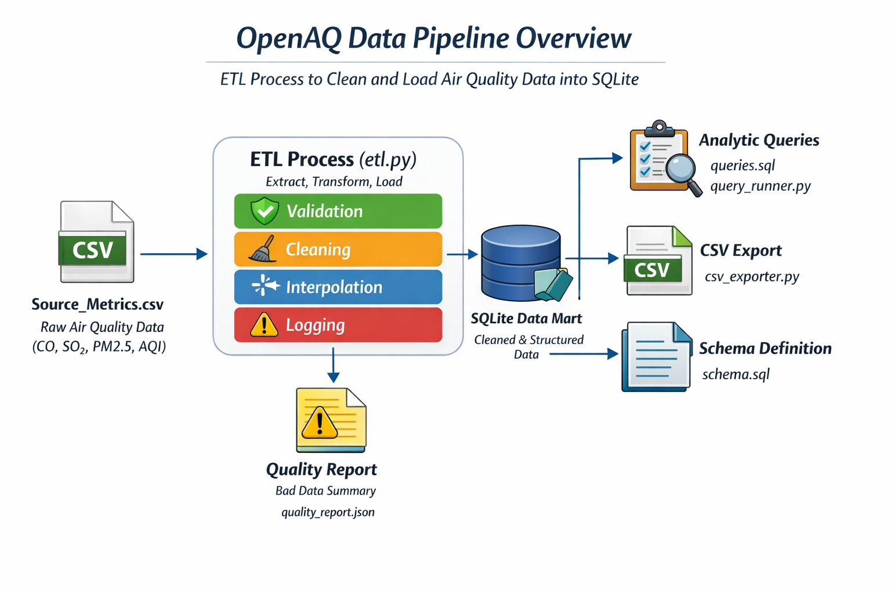

# OpenAQ Data Pipeline Prototype

This project implements a local data pipeline for the OpenAQ 2017 air quality dataset.

---


## 📊 OpenAQ Data Pipeline Overview



*ETL process to clean and load air quality data into SQLite for analytics and reporting.*

---

## What is included

- `etl.py`: Python ETL script that reads `Source_Metrics.csv`, validates and cleans records, interpolates hourly gaps, and loads a local SQLite data mart at `data_mart.db`.
- `queries.sql`: Analytic SQL queries that satisfy the business requirements for CO, SO2, PM2.5 and an hourly air quality index.
- `data_mart.db`: Generated SQLite database after running the pipeline.
- `quality_report.json`: Bad-data summary report produced by the ETL run.

## How it works

1. The pipeline reads the CSV source file.
2. It filters invalid rows and records bad data with reasons.
3. It interpolates missing hourly measurements for repeated `(location, parameter)` groups.
4. It builds a dimensional model and loads cleaned data into SQLite.
5. It writes a quality report summarizing excluded rows.

## Data quality and interpolation

- Known pollutant measurements are validated against expected units and realistic ranges.
- Invalid coordinates, missing dimensions, and values that would distort analysis are excluded.
- Interpolation is limited to short gaps between real readings (up to 3 hours) to preserve data quality.

## Running the pipeline

From the repository root:

```powershell
python etl.py
python query_runner.py
python csv_exporter.py
```

## Notes

- The ETL uses the standard Python library only, so no additional packages are required.
- `queries.sql` is written for a Redshift/PostgreSQL-compatible analytic engine.
- The data mart schema is intentionally simple and extensible for future scaling.
